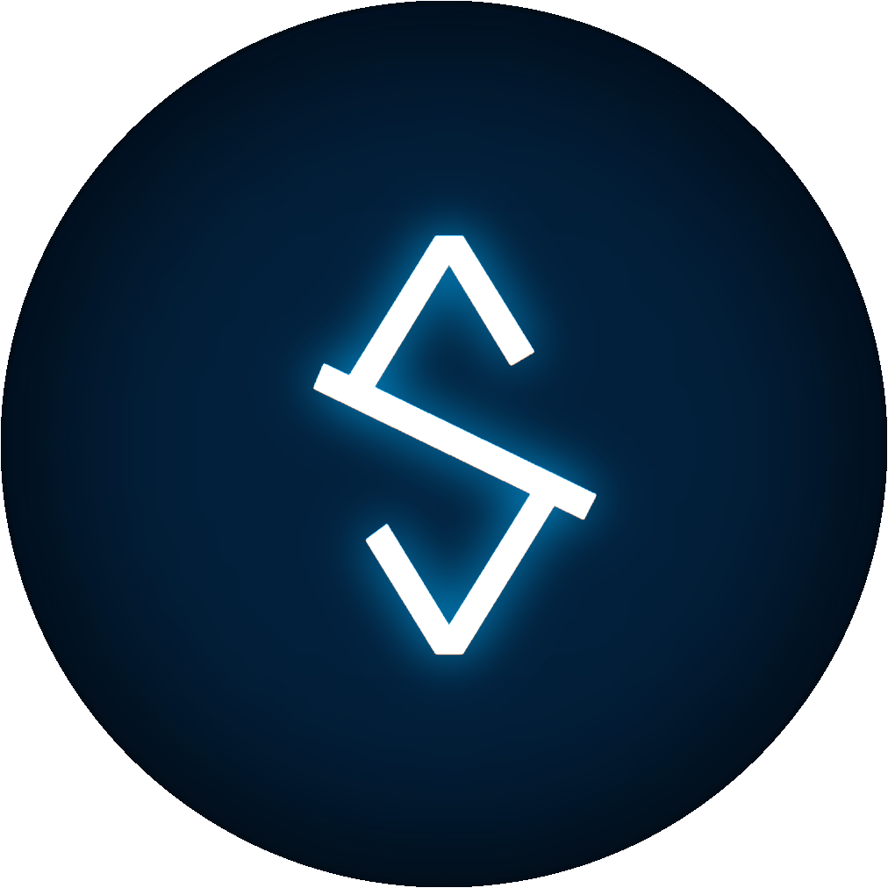

<!-- Improved compatibility of back to top link: See: https://github.com/othneildrew/Best-README-Template/pull/73 -->

<a name="readme-top"></a>

<!--
*** Thanks for checking out the Best-README-Template. If you have a suggestion
*** that would make this better, please fork the repo and create a pull request
*** or simply open an issue with the tag "enhancement".
*** Don't forget to give the project a star!
*** Thanks again! Now go create something AMAZING! :D
-->

<!-- PROJECT SHIELDS -->
<!--
*** I'm using markdown "reference style" links for readability.
*** Reference links are enclosed in brackets [ ] instead of parentheses ( ).
*** See the bottom of this document for the declaration of the reference variables
*** for contributors-url, forks-url, etc. This is an optional, concise syntax you may use.
*** https://www.markdownguide.org/basic-syntax/#reference-style-links
-->

[![Contributors][contributors-shield]][contributors-url]
[![Forks][forks-shield]][forks-url]
[![Stargazers][stars-shield]][stars-url]
[![Issues][issues-shield]][issues-url]
[![MIT License][license-shield]][license-url]
[![LinkedIn][linkedin-shield]][linkedin-url]

<!-- PROJECT LOGO -->
<br />
<div align="center">
  <a href="https://github.com/zylcom/smwaash">
    
  </a>

<h3 align="center">Smwaash</h3>

  <p align="center">
    Landing page template for your business.
    <br />
    <a href="https://github.com/zylcom/smwaash"><strong>Explore the docs »</strong></a>
    <br />
    <br />
    <a href="https://github.com/zylcom/smwaash">View Demo</a>
    ·
    <a href="https://github.com/zylcom/smwaash/issues/new?labels=bug&template=bug-report---.md">Report Bug</a>
    ·
    <a href="https://github.com/zylcom/smwaash/issues/new?labels=enhancement&template=feature-request---.md">Request Feature</a>
  </p>
</div>

<!-- TABLE OF CONTENTS -->
<details>
  <summary>Table of Contents</summary>
  <ol>
    <li>
      <a href="#about-the-project">About The Project</a>
      <ul>
        <li><a href="#built-with">Built With</a></li>
      </ul>
    </li>
    <li>
      <a href="#getting-started">Getting Started</a>
      <ul>
        <li><a href="#prerequisites">Prerequisites</a></li>
        <li><a href="#installation">Installation</a></li>
      </ul>
    </li>
    <li><a href="#usage">Usage</a></li>
    <li><a href="#roadmap">Roadmap</a></li>
    <li><a href="#contributing">Contributing</a></li>
    <li><a href="#license">License</a></li>
    <li><a href="#contact">Contact</a></li>
    <li><a href="#acknowledgments">Acknowledgments</a></li>
  </ol>
</details>

<!-- ABOUT THE PROJECT -->

## About The Project


There many great template available on Google. But I want create an amazing template too so that will can be used by many people. I hope this will be an amazing project.

<p align="right">(<a href="#readme-top">back to top</a>)</p>

### Built With

- [![Tailwindcss][Tailwindcss.com]][Tailwindcss-url]
- [![Vite][Vite.com]][Vite-url]
- [![Typescript][Typescript.com]][Typescript-url]

<p align="right">(<a href="#readme-top">back to top</a>)</p>

<!-- GETTING STARTED -->

## Getting Started

This is step to using this template.

### Prerequisites

This is an list things you need to use the software and how to install them.

- yarn
  ```sh
  npm install yarn@latest -g
  ```

### Installation

1. Clone the repo
   ```sh
   git clone https://github.com/zylcom/smwaash.git
   ```
2. Install needs packages
   ```sh
   yarn
   ```
3. Run development server
   ```sh
   yarn run dev
   ```
4. To build project to production ready file
   ```sh
   yarn run build
   ```

<p align="right">(<a href="#readme-top">back to top</a>)</p>

<!-- USAGE EXAMPLES -->

## Usage

You can edit the content inside `index.html` file to your business content. You can store assets files in public folder.

<!-- _For more examples, please refer to the [Documentation](https://example.com)_ -->

<p align="right">(<a href="#readme-top">back to top</a>)</p>

<!-- ROADMAP -->

## Roadmap

This is list about the available and future feature that will be added.

- [x] Implement responsive design
- [ ] Add hiring form
- [ ] Add blog page
  - [ ] Add create blog
  - [ ] Add read blog
  - [ ] Add update blog
  - [ ] Add delete blog

See the [open issues](https://github.com/zylcom/smwaash/issues) for a full list of proposed features (and known issues).

<p align="right">(<a href="#readme-top">back to top</a>)</p>

<!-- CONTRIBUTING -->

## Contributing

Contributions are what make the open source community such an amazing place to learn, inspire, and create. Any contributions you make are **greatly appreciated**.

If you have a suggestion that would make this better, please fork the repo and create a pull request. You can also simply open an issue with the tag "enhancement".
Don't forget to give the project a star! Thanks again!

1. Fork the Project
2. Create your Feature Branch (`git checkout -b feature/AmazingFeature`)
3. Commit your Changes (`git commit -m 'Add some AmazingFeature'`)
4. Push to the Branch (`git push origin feature/AmazingFeature`)
5. Open a Pull Request

<p align="right">(<a href="#readme-top">back to top</a>)</p>

<!-- LICENSE -->

## License

Distributed under the MIT License. See `LICENSE.txt` for more information.

<p align="right">(<a href="#readme-top">back to top</a>)</p>

<!-- CONTACT -->

## Contact

Sabilillah - sabilillah272@gmail.com

Project Link: [https://github.com/zylcom/smwaash](https://github.com/zylcom/smwaash)

<p align="right">(<a href="#readme-top">back to top</a>)</p>

<!-- ACKNOWLEDGMENTS -->

## Acknowledgments

- [Tailwindcss Docs][Tailwindcss-url]
- [TypeScript Docs][Typescript-url]
- [Vite Docs][Vite-url]

<p align="right">(<a href="#readme-top">back to top</a>)</p>

<!-- MARKDOWN LINKS & IMAGES -->
<!-- https://www.markdownguide.org/basic-syntax/#reference-style-links -->

[contributors-shield]: https://img.shields.io/github/contributors/zylcom/smwaash.svg?style=for-the-badge
[contributors-url]: https://github.com/zylcom/smwaash/graphs/contributors
[forks-shield]: https://img.shields.io/github/forks/zylcom/smwaash.svg?style=for-the-badge
[forks-url]: https://github.com/zylcom/smwaash/network/members
[stars-shield]: https://img.shields.io/github/stars/zylcom/smwaash.svg?style=for-the-badge
[stars-url]: https://github.com/zylcom/smwaash/stargazers
[issues-shield]: https://img.shields.io/github/issues/zylcom/smwaash.svg?style=for-the-badge
[issues-url]: https://github.com/zylcom/smwaash/issues
[license-shield]: https://img.shields.io/github/license/zylcom/smwaash.svg?style=for-the-badge
[license-url]: https://github.com/zylcom/smwaash/blob/master/LICENSE.txt
[linkedin-shield]: https://img.shields.io/badge/-LinkedIn-black.svg?style=for-the-badge&logo=linkedin&colorB=555
[linkedin-url]: https://linkedin.com/in/sabilillah
[product-screenshot]: images/screenshot.png
[Next.js]: https://img.shields.io/badge/next.js-000000?style=for-the-badge&logo=nextdotjs&logoColor=white
[Next-url]: https://nextjs.org/
[React.js]: https://img.shields.io/badge/React-20232A?style=for-the-badge&logo=react&logoColor=61DAFB
[React-url]: https://reactjs.org/
[Vue.js]: https://img.shields.io/badge/Vue.js-35495E?style=for-the-badge&logo=vuedotjs&logoColor=4FC08D
[Vue-url]: https://vuejs.org/
[Angular.io]: https://img.shields.io/badge/Angular-DD0031?style=for-the-badge&logo=angular&logoColor=white
[Angular-url]: https://angular.io/
[Svelte.dev]: https://img.shields.io/badge/Svelte-4A4A55?style=for-the-badge&logo=svelte&logoColor=FF3E00
[Svelte-url]: https://svelte.dev/
[Laravel.com]: https://img.shields.io/badge/Laravel-FF2D20?style=for-the-badge&logo=laravel&logoColor=white
[Laravel-url]: https://laravel.com
[Bootstrap.com]: https://img.shields.io/badge/Bootstrap-563D7C?style=for-the-badge&logo=bootstrap&logoColor=white
[Bootstrap-url]: https://getbootstrap.com
[JQuery.com]: https://img.shields.io/badge/jQuery-0769AD?style=for-the-badge&logo=jquery&logoColor=white
[JQuery-url]: https://jquery.com
[Tailwindcss.com]: https://img.shields.io/badge/tailwindcss-38BDF8?style=for-the-badge&logo=tailwindcss&logoColor=white
[Tailwindcss-url]: https://tailwindcss.com
[Vite.com]: https://img.shields.io/badge/vite-BD34FE?style=for-the-badge&logo=vite&logoColor=FFDD35
[Vite-url]: https://vitejs.dev/
[Typescript.com]: https://img.shields.io/badge/typescript-007acc?style=for-the-badge&logo=typescript&logoColor=white
[Typescript-url]: https://www.typescriptlang.org/
